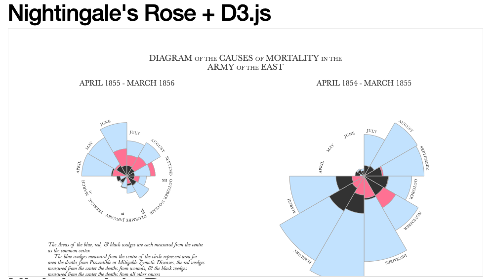

# Chinatown Crime Reports Web Map
**By Yihang Sun**

#### Introduction
This project was based on a research topic about **Chinatown Racism** developed by Yihang Sun. In the paper, author has reviewed the history and literatures of racism actions to Asian Americans , especially those with low level of education who have to stay in the Chinatown. Therefore, _racism to Chinatown is also opressions to marginalized poorly educated Asian Americans_. In the paper, the author has mentioned the unfair and hateful behaviors happened as pattern after the outbreak of diseases, because before Asian Americans were called "Yellow Peril" with killing germs. Therefore, this project serves as a research GIS method to look at whether racism is still exist. The purpose is comparing and mapping crime reports before and after the outbreak of **COVID-19** in some major cities that has Chinatown.

#### Inspired By

[Nightingale's Rose](http://bl.ocks.org/kgryte/5926740)

---

#### Functions
- **Rose Chart**: developed a rose chart with AntV G2 library to show total crimes in each month (I only did to May beacuse of lack of data)
- **Home Button**: return the map to intial size
- **Hide Chart**: initiate when zoom called
- **Zoom In Animation**: zoom into the polygon by double clicking city marker
- **Mouse Hover**: both on the chart and polygons
- **Change Color by Hovering**: change the polygon color
- **Popup Window**: on each marker

#### Data-Prep Steps
1. Find 2020 data of representative major cities with Chinatown on their gov.websites
2. Clean the data (coordinates, report date, crime category)
3. Open geojson.io and locate city's chinatown; draw the boundary and convert to geojson and shapefile
4. Load csv and shapefile into qgis with backgrounds
5. Use vector tool to find interaction between crimes cvs and Chinatown Shapefile, export as geojson
6. Upload them to git repository

----

#### Libraries
-  https://unpkg.com/leaflet@1.4.0/dist/leaflet.js
- https://cdnjs.cloudflare.com/ajax/libs/leaflet-ajax/2.1.0/leaflet.ajax.min.js
- https://ajax.googleapis.com/ajax/libs/jquery/3.1.0/jquery.min.js
- https://cdnjs.cloudflare.com/ajax/libs/chroma-js/1.3.4/chroma.min.js
- https://a.alipayobjects.com/jquery/jquery/1.11.1/jquery.js
- https://gw.alipayobjects.com/as/g/datavis/g2/2.3.13/index.js

#### DataSet link
1. [Seattle Crime Reports](https://data.seattle.gov/Public-Safety/SPD-Crime-Data-2008-Present/tazs-3rd5)
2. [Los Angeles Crime Data from 2020 to Present](https://data.lacity.org/A-Safe-City/Crime-Data-from-2020-to-Present/2nrs-mtv8)
3. [Chicago Crimes 2020](https://data.cityofchicago.org/Public-Safety/Crimes-2020/qzdf-xmn8)
4. [Philadelphia Crime Incidents from 2020](https://www.opendataphilly.org/dataset/crime-incidents/resource/a2373b85-408b-4144-84e9-cb24843e5f2b)
5. [Boston Crime Incident Reports](https://data.boston.gov/dataset/crime-incident-reports-august-2015-to-date-source-new-system/resource/12cb3883-56f5-47de-afa5-3b1cf61b257b)
6. [San Fransico Police Department Incident Reports: 2018 to Present](https://data.sfgov.org/Public-Safety/Police-Department-Incident-Reports-2018-to-Present/wg3w-h783)

*_[Atlanta Raw Crime Data 2020](https://www.atlantapd.org/i-want-to/crime-data-downloadshas) incomplete reports which cannot be used_

*_[NYPD Complaint Data Current (Year To Date)](https://data.cityofnewyork.us/Public-Safety/NYPD-Complaint-Data-Current-Year-To-Date-/5uac-w243), has incomplete reports which cannot be used_

#### Acknowledgement:
Seattle.gov; Los Angeles Open Data; NYC Open Data; Chicago Data Portal; Atlanta Police Department; Open Data Philly; Analyze Boston; Data SF
